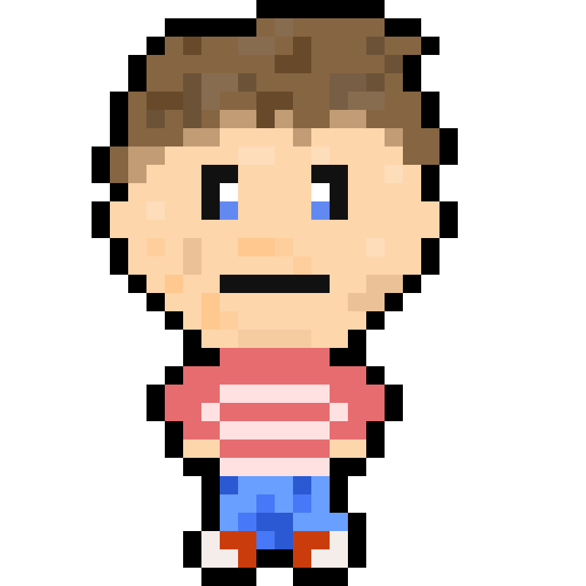

# Linked Lunancy

## Elevator Pitch

Linked Lunacy is a puzzle based educational game where players repair, reorder, and traverse chains of nodes to learn how linked lists function through interactive problem solving.

## Influences (Brief)

- *Influence #1*: Pipes
  - Medium: Video Game
  - Explanation: Pipes is a logic puzzel where you must connect the pipes to create a path that connects all the pipes. Similarly, Linked Lunancy is about building a bridge to connect two sides and using logic to build the bridge. 
- *Influence #2*: Tetris 99 
  - Medium: Video Game
  - Explanation: Tetris 99 is about matching and connecting pieces to clear blocks as pieces fall down. The more blocks cleared, the more points earned. Similarly, Linked Lunancy will have bridge pieces that are continuously given to the player and they must use those pieces to connect the bridge. Loss points/fail when bridge piece nodes are not correctly connected.
- *Influence #3*: Human Resource Machine
  - Medium: Video Game
  - Explanation: Human Resource Machine teaches programming logic through interactive puzzles rather than lectures. Linked Lunacy follows a similar approach by teaching linked list operations through visual experimentation, mistake correction, and level based challenges.
- *Influence #4*: Earthbound
  - Medium: Video Game
  - Explanation: the character and art design is meant to be pixel similar to that of Earthbound to create and warm and fun game art style. Also gives it a more authentic game feel and in general more inviting.   

## Core Gameplay Mechanics (Brief)

- Players must click and drag the connectors (pointers) between each bridge tile to build the bridge 
- Players must safely remove "bad" tiles to prevent the bridge from collapsing/losing points
- Players must be able to traverse the bridge based on given code statements and arrive at the correct location (i.e. spot= head->next->next->prev)
- Bridge tiles represent nodes within a linked list and connectors represent pointers that link nodes together
- Players must ensure that node coneections maintain a valid linked list structure

# Learning Aspects

## Learning Domains

- General Python programming knowledge
- General Typescript/Javascript programming knowledge
- Arrays and data structure purpose
- Computer Science fundamentals
- Data structures and algorithms
- Logical reasoning and problem solving

## Target Audiences

- Novice and Intermediate computer programmers
- Logic puzzle game players
- Users interested in data structures
- Self-taught programmers seeking visual ways to undertand abstract programming

## Target Contexts

- Used in a data structure class as in-class learning activity
- An extra resource tool to understand the concepts behind linked lists
- Used as an additional study tool outside of class
- Used in tutoring environments or study groups to reinforce linked list concepts

## Learning Objectives

- *Singly and Doubly Linked List Structure*: *Players will be able to identify what kind of linked list (double or single) is given to them based on the structure*
- *Linked List Traversal*: *Students will be able to traverse through a linked list from either the head or tail of the linked list from code statements of "prev" and "next"*
- *Insertion and Deletion*: *Students will be able to insert or delete nodes at the beginning, end, or middle of a linked list while keeping the data structure intact and functioning as intended*
- *Pointer Relationships*: *Players will be able to identify whether pointer connections between nodes are correct or broken*

## Prerequisite Knowledge

- *Prior to the game, players should explain the differences and similarities between a linked list and an array*
- *Prior to the game, players must be a able to create and identify the conponents of objects in either python/javascript/typescript/C/C++ or some other programming language that uses objects*
- *Players should be familiar with basic programming terminology such as variables, objects, and references*
- *Players should be able to follow simple logical instructions similar to pseudocode*

## Assessment Measures

- *Given a linked list and statements traversing through the linked list, correctly identify the resulting node (logic)*
- *Given a node and linked list, insert the node while maintaining the proper linked list structure (rubic)*
- *Given a broken linked list, correctly repair the pointer connection so that the list can be fully traversed (logic)*
- *Given a linked list structure, identify whether the structure represents a singly or doubly linked list (logic)*

# What sets this project apart?

- *Provides a visually appealing and fun way to learn linked list*
- *The game can be played by people outside of the computer science field and be played by people who enjoy logic puzzles*
- *Offers various modes of playing to learn different concepts including doubly linked list and singly linked list*
- *Transforms abstract pointer relationships into visual and interactive gameplay mechanics*
- *Encourages experimentation and problem solving rather than memorization of code syntax*

# Player Interaction Patterns and Modes

## Player Interaction Pattern

Players interact with the game using a mouse and keyboard. Nodes and pointer connectors can be selected, dragged, or repositioned depending on the objective of the level. Most levels involve inspecting a chain of nodes, modifying pointer connections, inserting new nodes, or removing incorrect nodes while maintaining a valid linked list structure. The game is designed primarily as a single player experience where the player solves logic puzzlesinvoling nore manipulation. Immediate feedback is given when connections are valid or incorrect, allowing players to learn through trial, correction, and iteration.

## Player Modes

- *Main Menu*: *Allows players to start the game through choosign a type of linked list challenge.*
- *Gameplay Mode*: *Players solve linked list puzzles involving traversal, insertion, deletion, and structure identification. As players answer questions correctly, the difficulty increases by introducing more complex linked list operations and larger node structures.*
- *Game Over/Results*: *After the player makes too mny mistakes or completes a sequence of puzzles, the game displays the player's performance statistics such as number of correct answers, accuracy, and highest difficulty reached.*

# Gameplay Objectives

- *Primary Objective #1*:
    - Description: *Construct or repair a bridge of nodes so that all nodes are correctly connected and traversable from the head node.*
    - Alignment: *Supports learning objectives related to identifying linked list structures and pointer relationships.*
- *Primary Objective #2*:
    - Description: *Correctly insert or remove nodes without breaking the overall linked list structure.*
    - Alignment: *Directly aligns with insertion and deletion learning objectives*
- *Primary Objective #3*:
    - Description: *Follow traversal instructions and identify the correct resulting node.*
    - Alignment: *Supports the linked list traversal learning objective.*

# Procedures/Actions

Players interact with the game primarily using a mouse. The player is presented with a linked list structure represented visually as connected bridge tiles (nodes). Each tile contains pointer connectors that represent the relationship between nodes.

Players can perform several actions during gameplay:
- Drag pointer connectors between nodes to repair or modify the linked list
- Insert new nodes into the linked list at valid positions
- Remove nodes from the linked list while maintaining a valid structure
- Follow traversal instructions to determine which node is reached
- Submit their answer to confirm the solution
- Progress to the next puzzle if the solution is correct

# Rules

Players are presented with puzzles involving linked list structures. Each puzzle asks the player to perform a specific task such as identifying the correct node after traversal, inserting a node in the correct location, or deleting a node while maintaining proper pointer connections.

The player must ensre that all nodes remain connected correctly so the linked list remains valid. Incorrect pointer connections may cause the structure to break, preventing traversal from reaching all nodes.

The game tracks the number of incorrect answers the player makes. If the player exceeds the allowed number of mistakes, the game ends and the player is shown their results. Correct answers increase the player's score and gradually increase the difficulty of future puzzles.

# Objects/Entities

- Node Tiles: Represent elements in the linked list and contain stored values.
- Pointer Connectors: Visual links representing the next or prev references between nodes.
- Head Indicator: Marks the starting point of traversal within the linked list.
- Tail Indicator: Marks the final node of the linked list.
- Insertable Nodes: New nodes that appear during insertion puzzles.
- Removable Nodes: Nodes that must be deleted during deletion puzzles.
- Traversal Marker: A visual indicator that moves along nodes during traversal tasks.
- Score Counter: Tracks the number of correct answers achieved by the player.

## Core Gameplay Mechanics (Detailed)

- *Pointer Connection System*: *Players interact with the linked list by dragging pointer connectors between nodes. These connectors represent the next or prev relationships within the linked list. Correct pointer connections allow the structure to function properly, while incorrect connections break the list and prevent traversal.*
- *Traversal Challenges*: *Players are given traversal expressions similar to programming syntax, such as head -> next -> next. The player must determine which node the traversal ends on by following the pointer connections step by step through the linked list.*
- *Node Insertion and Deletion*: *Players modify the linked list by inserting new nodes into the correct position or removing nodes from the structure. To succeed, players must update the surrounding pointer connections so the linked list remains valid and traversable.*
   
## Feedback

Players receive immediate visual feedback after performing actions. Correct pointer connections may glow or highlight to indicate a valid linked list structure. Incorrect connections may flash red or break visually to show that the structure is invalid. Traversal tasks may include animated movement across nodes so the player can visually follow the path taken through the linked list.

After completing puzzles or reaching the end of a game session, players are shown performance statistics such as the number of correct answers, accuracy percentage, and the highest difficulty level reached. This allows players to track their improvement as they progress through increasingly difficult linked list challenges.

# Story and Gameplay

## Presentation of Rules

The game introduces players to linked list mechanics gradually through puzzle progression. Early puzzles focus on simple traversal tasks involving small linked lists. As players solve puzzles correctly, the game introduces more complex actions such as inserting and deleting nodes. By learning through interaction with the linked list structures, players develop an intuitive understanding of how node connections and pointer relationships function.

## Presentation of Content

The educational content is integrated directly into the puzzles themselves. Instead of reading explanations, players learn linked list concepts by solving increasingly complex problems involving traversal, insertion, and deletion.

Visual representations of nodes and pointer connections help translate abstract programming concepts into interactive gameplay elements.

## Story (Brief)

A traveler needs to cross a broken bridge made of connected tiles, but many of the connections between the tiles are missing or incorrect. The player must repair and maintain the bridge by correctly connecting nodes so the traveler can safely cross from one side to the other.

## Storyboarding

*Go into as much detail as needs be to visually convey the Dynamics of your game. Be detailed. Create storyboards and freeze frame images that concisely capture important key elements of your game. You are strongly recommended to sketch pictures on paper and embed them here. Be sure make it clear how previously-described mechanics come through in the dynamics.*

https://drive.google.com/file/d/1G_LkTDzM-ff1XqdCN4sFte8nYnCOAZKN/view?usp=sharing
A rough sketch of a storyboard of the game
- *Scene 1*: The inital state of the game in which the player is given a gorup of bridge tiles (nodes) and must place and connect them correctly through a click and drag function
- *Scene 2*: The second scene shows a successfully completed bridge 
- *Scene 3*: The third scene is the player given statements of code the shows the correct in order in which to travel the bridge as to not get blown off
- *Scene 4*: Scene 4 is an example of the player landing on the correct tile node and progressing to the next stage
- *Scene 5*: The 5th scene is a different level in which the player is given a broken bridge and must correctly connect the tiles
- *Scene 6*: The 6th scene is what happens when the bridge is incorrectly fixed in which one of the pointers snaps and bridge collapses as and the player falls into the river
# Assets Needed

## Aesthetics

The game takes place in a scenic mountain hiking environment where the player must repair sections of a broken wooden bridge to help a traveler safely cross from one side of a canyon to the other. The background features mountains, forests, cliffs, and flowing rivers, creating the feeling of a peaceful but adventurous journey.

Bridge tiles represent sections of the bridge and appear as wooden planks connected by ropes or metal fasteners. Pointer connections between nodes are visually represented by ropes or glowing connectors that show how each bridge tile is linked to the next. Broken or incorrect connections may appear as loose ropes or damaged planks to visually communicate that the structure is unstable.

The overall atmosphere should feel adventurous and outdoorsy, with warm natural colors such as greens, browns, and sky blues. The environment should evoke the feeling of exploring the mountains while solving puzzles that repair the bridge and allow the traveler to continue their journey.

## Graphical

- Characters List:
  - *Alex, a playable character with brown hair, blue eyes, a red striped shirt, jeans, and red converse-like shoes. Standard all around character* 
  - *Amy, another playable character with long curly black hair, yellow shirt, and brown pants.*
  - *Neo, another playable character with a blond hair, a blue shirt, and black pants*
- Textures
  - Node tile textures
  - Pointer connector textures
  - Highlight effects for valid connections
  - Error effects for invalid connections
- Environment Art/Textures
  - Mountain range background
  - Interface panels for puzzle instructions

## Audio

- Music List (Ambient sound)
  - *Main Menu*: *calm digital ambience*
  - *Gameplay*: *light puzzle-themed background music*
  - *Results screen*: *short completion theme*
  
- Sound List (SFX)
  - *Pointer connected*: *soft click*
  - *Incorrect connection*: *error buzz*
  - *Node inserted*: *pop or placement sound*
  - *Node removed*: *dissolve sound*
  - *Puzzle complete*: *success chime that invokes successful journey* Example: https://www.youtube.com/watch?v=-sspGNVHl8E&list=RD-sspGNVHl8E&start_radio=1

# Metadata

* Template created by Austin Cory Bart <acbart@udel.edu>, Mark Sheriff, Alec Markarian, and Benjamin Stanley.
* Version 0.0.3
